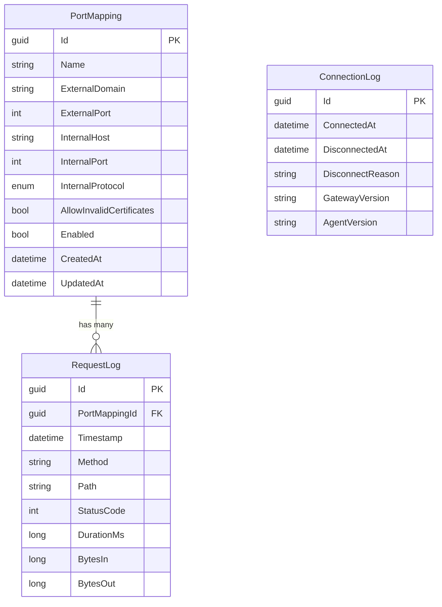

# feat: Octoporty - Reverse Proxy Tunneling Solution

## Enhancement Summary

**Deepened on:** 2026-01-20
**Sections enhanced:** 12
**Research agents used:** WebSocket tunnel patterns, FastEndpoints conventions, Caddy Admin API, Docker chiseled images, React + Tailwind 4, Security (sentinel), Architecture (strategist), Performance (oracle), Code Simplicity, Frontend Design, Agent-Native Architecture, TypeScript patterns

### Key Improvements
1. **Protocol Enhancement** - MessagePack binary serialization for tunnel messages (30% bandwidth reduction), explicit connection state machine, multiplexed request streaming
2. **Authentication Hardening** - API key authentication (simpler than JWT for single-agent), HMAC-signed control messages, rate limiting on auth failures
3. **Reconnection Strategy** - Exponential backoff with jitter (prevents thundering herd), configurable max delay, connection state events for UI
4. **Architecture Refinements** - Configuration versioning (optimistic locking), circuit breaker for internal services, self-healing Caddy route verification

### New Considerations Discovered
- **Configuration Drift Prevention** - Add version/hash to config sync, Gateway rejects stale configs
- **Request Correlation** - Add `X-Octoporty-Request-Id` header for end-to-end tracing
- **Graceful Shutdown** - Drain in-flight requests before disconnecting tunnel
- **Memory Efficiency** - Use `System.IO.Pipelines` for zero-copy request forwarding

---

## Overview

Octoporty is a self-hosted reverse proxy tunneling solution similar to ngrok, built in .NET. It enables exposing internal services to the internet through secure tunnels, with a web-based configuration interface.

**Architecture:**
- **Caddy** - Edge proxy for SSL termination on Hetzner cloud
- **Octoporty.Gateway** - Stateless .NET cloud service receiving tunnel connections
- **Octoporty.Agent** - .NET internal service with Web UI, holds master configuration in SQL Server

```
┌─────────────────────────────────────────────────────────────────────────────┐
│                              HETZNER CLOUD                                  │
│  ┌─────────────┐        ┌─────────────────────────────────────────────┐    │
│  │   Caddy     │        │           Octoporty.Gateway                 │    │
│  │   (Edge)    │───────▶│  - Receives tunnel connections              │    │
│  │  SSL Term.  │        │  - Routes requests through tunnels          │    │
│  │  Port 443   │        │  - Configures Caddy via Admin API           │    │
│  └─────────────┘        │  - Stateless (config from Agent)            │    │
│                         └──────────────────┬──────────────────────────┘    │
└─────────────────────────────────────────────┼──────────────────────────────┘
                                              │
                                              │ WebSocket Tunnel
                                              │ (Outbound from Agent)
                                              ▼
┌─────────────────────────────────────────────────────────────────────────────┐
│                           INTERNAL NETWORK                                  │
│  ┌─────────────────────────────────────────────────────────────────────┐   │
│  │                      Octoporty.Agent                                 │   │
│  │  ┌──────────────┐  ┌──────────────┐  ┌──────────────────────────┐  │   │
│  │  │ React Web UI │  │  FastEndpoints │  │  Tunnel Client          │  │   │
│  │  │ (Config)     │  │  (REST API)    │  │  (WebSocket to Gateway) │  │   │
│  │  └──────────────┘  └──────────────┘  └──────────────────────────┘  │   │
│  │                           │                                          │   │
│  │                    ┌──────┴──────┐                                   │   │
│  │                    │  SQL Server │                                   │   │
│  │                    │ (Config DB) │                                   │   │
│  │                    └─────────────┘                                   │   │
│  └─────────────────────────────────────────────────────────────────────┘   │
│                                              │                              │
│                                              ▼                              │
│                              ┌─────────────────────────┐                   │
│                              │   Internal Services     │                   │
│                              │   (HTTP/HTTPS apps)     │                   │
│                              └─────────────────────────┘                   │
└─────────────────────────────────────────────────────────────────────────────┘
```

## Problem Statement / Motivation

**Why build this?**

1. **Self-hosted control** - Unlike ngrok's SaaS model, full control over infrastructure and data
2. **Cost efficiency** - No per-connection or bandwidth fees after initial setup
3. **Privacy** - All traffic routes through your own infrastructure
4. **Customization** - Full control over domains, SSL, and routing rules

**Target Use Cases:**
- Exposing development servers for testing
- Webhook development and debugging
- Accessing internal services remotely
- Demo environments without VPN complexity

## Proposed Solution

Build a three-component system using modern .NET 10 with:

1. **Caddy as edge proxy** - Handles SSL termination, automatic HTTPS certificates
2. **Gateway service** - Stateless tunnel endpoint that receives connections and routes traffic
3. **Agent service** - Master configuration holder with Web UI, establishes outbound tunnel

### Technology Stack

| Component | Technology | Rationale |
|-----------|------------|-----------|
| Runtime | .NET 10 LTS | Latest features, WebSocketStream, long-term support |
| API Framework | FastEndpoints | High performance, vertical slices, FluentValidation |
| Database | SQL Server + EF Core | Enterprise-ready, existing infrastructure |
| Tunnel Protocol | WebSocket over HTTPS | Firewall-friendly, well-supported, bidirectional |
| Serialization | MessagePack | Binary format, 30% smaller than JSON, faster |
| Real-time UI | SignalR | Status updates, native .NET/browser support |
| Frontend | React + Vite + Tailwind 4 | Modern tooling, fast HMR, CSS-first config |
| Edge Proxy | Caddy | Admin API, automatic HTTPS, simple config |
| Containers | Docker (chiseled images) | 80%+ size reduction, security |

#### Research Insights: Technology Choices

**MessagePack vs JSON for Tunnel Protocol:**
- MessagePack is ~30% smaller and 2-3x faster to serialize
- Critical for high-throughput scenarios with many concurrent requests
- .NET has excellent support via `MessagePack-CSharp` package
- Fallback: Use JSON for debugging with `OCTOPORTY_DEBUG_JSON=true`

**FastEndpoints Patterns (Vertical Slice Architecture):**
```csharp
// Group endpoints by feature, not layer
// src/Octoporty.Agent/Features/Mappings/CreateMapping.cs
public class CreateMappingEndpoint : Endpoint<CreateMappingRequest, MappingResponse>
{
    public override void Configure()
    {
        Post("/api/v1/mappings");
        AllowAnonymous(); // Auth handled by middleware
        Description(x => x
            .Produces<MappingResponse>(201)
            .ProducesProblem(400)
            .WithTags("Mappings"));
    }

    public override async Task HandleAsync(CreateMappingRequest req, CancellationToken ct)
    {
        // Validation happens automatically via FluentValidation
        var mapping = req.ToEntity();
        await _db.PortMappings.AddAsync(mapping, ct);
        await _db.SaveChangesAsync(ct);
        await SendCreatedAtAsync<GetMappingEndpoint>(new { id = mapping.Id }, mapping.ToResponse(), ct);
    }
}
```

**References:**
- [MessagePack-CSharp Documentation](https://github.com/MessagePack-CSharp/MessagePack-CSharp)
- [FastEndpoints Best Practices](https://fast-endpoints.com/docs/best-practices)

## Technical Approach

### Architecture

#### Component 1: Caddy Configuration

Caddy serves as the SSL-terminating reverse proxy. Configuration via Admin API on port 2019.

**Caddyfile (base configuration):**
```caddyfile
{
    admin 0.0.0.0:2019
    auto_https on
}

# Dynamic routes added via Admin API
```

**Admin API integration from Gateway:**
```csharp
// Gateway adds/removes routes when Agent provides configuration
POST /config/apps/http/servers/srv0/routes
{
  "@id": "tunnel-myapp",
  "match": [{ "host": ["myapp.yourdomain.com"] }],
  "handle": [{
    "handler": "reverse_proxy",
    "upstreams": [{ "dial": "localhost:5000" }]
  }]
}
```

#### Research Insights: Caddy Admin API

**Typed C# Client for Caddy Admin API:**
```csharp
// src/Octoporty.Gateway/Infrastructure/CaddyAdminClient.cs
public class CaddyAdminClient : ICaddyAdminClient
{
    private readonly HttpClient _http;
    private readonly ILogger<CaddyAdminClient> _logger;

    public async Task<bool> AddRouteAsync(string routeId, CaddyRoute route, CancellationToken ct)
    {
        var json = JsonSerializer.Serialize(route, _jsonOptions);
        var content = new StringContent(json, Encoding.UTF8, "application/json");

        var response = await _http.PostAsync(
            $"/config/apps/http/servers/srv0/routes",
            content, ct);

        if (!response.IsSuccessStatusCode)
        {
            var error = await response.Content.ReadAsStringAsync(ct);
            _logger.LogError("Caddy route add failed: {Error}", error);
            return false;
        }
        return true;
    }

    public async Task<bool> RemoveRouteAsync(string routeId, CancellationToken ct)
    {
        var response = await _http.DeleteAsync(
            $"/id/{routeId}", ct);
        return response.IsSuccessStatusCode;
    }

    public async Task<bool> IsHealthyAsync(CancellationToken ct)
    {
        try
        {
            var response = await _http.GetAsync("/config/", ct);
            return response.IsSuccessStatusCode;
        }
        catch { return false; }
    }
}
```

**Caddy Self-Healing Pattern (No Polling):**

Instead of polling Caddy, use idempotent route verification on request failure:

```csharp
public class RequestRouter
{
    public async Task<HttpResponseMessage> RouteRequestAsync(HttpRequest request, CancellationToken ct)
    {
        var mapping = _mappings.GetByHost(request.Host);
        if (mapping == null) return NotFound();

        try
        {
            return await ForwardThroughTunnelAsync(request, mapping, ct);
        }
        catch (CaddyRouteNotFoundException)
        {
            // Route missing in Caddy (restart, config loss, etc.) - re-push and retry
            await _caddyClient.EnsureRouteExistsAsync(mapping, ct);
            return await ForwardThroughTunnelAsync(request, mapping, ct);
        }
    }
}
```

**Benefits:**
- Zero polling overhead
- Self-healing: routes are re-added on demand
- Maximum "downtime" after Caddy restart = one API call (~50ms), not 30 seconds
- Works for any route loss scenario, not just restarts

**References:**
- [Caddy Admin API Docs](https://caddyserver.com/docs/api)
- [Caddy JSON Config Structure](https://caddyserver.com/docs/json/)

#### Component 2: Octoporty.Gateway

**Responsibilities:**
- Listen for WebSocket connections from Agent
- Authenticate Agent using JWT/shared secret
- Receive configuration from Agent on connect
- Configure Caddy routes via Admin API
- Route incoming HTTP requests through tunnel to Agent
- Detect Caddy restarts and reconfigure

**Key Endpoints:**
```
WebSocket /tunnel          - Bidirectional tunnel connection
GET       /health          - Health check endpoint
GET       /api/v1/status   - Gateway status (for monitoring)
```

**Environment Variables (.NET Configuration Binding):**
```bash
# Uses .NET's built-in configuration - no manual mapping needed
# Double underscore (__) maps to hierarchy in appsettings.json

Gateway__ApiKey=<api-key-for-agent-authentication>
Gateway__CaddyAdminUrl=http://localhost:2019
Gateway__ListenPort=5000
Gateway__DebugJson=false
```

```csharp
// appsettings.json structure (auto-bound from environment variables)
{
  "Gateway": {
    "ApiKey": "",
    "CaddyAdminUrl": "http://localhost:2019",
    "ListenPort": 5000,
    "DebugJson": false
  }
}

// Strongly-typed options class
public class GatewayOptions
{
    public string ApiKey { get; set; } = "";
    public string CaddyAdminUrl { get; set; } = "http://localhost:2019";
    public int ListenPort { get; set; } = 5000;
    public bool DebugJson { get; set; }
}

// Program.cs - zero manual mapping
builder.Services.Configure<GatewayOptions>(builder.Configuration.GetSection("Gateway"));
```

#### Research Insights: Gateway Architecture

**Connection State Machine:**
```
┌────────────────┐
│  Disconnected  │◄────────────────────────────────────┐
└───────┬────────┘                                     │
        │ WebSocket connect                            │
        ▼                                              │
┌────────────────┐                                     │
│ Authenticating │──── auth failed ───────────────────►│
└───────┬────────┘                                     │
        │ auth success                                 │
        ▼                                              │
┌────────────────┐                                     │
│   Syncing      │──── sync failed ───────────────────►│
└───────┬────────┘                                     │
        │ config applied                               │
        ▼                                              │
┌────────────────┐                                     │
│    Active      │──── disconnect/error ──────────────►│
└────────────────┘
```

**Security Hardening:**
- Use API key (32+ bytes, cryptographically random) instead of JWT for simplicity
- Rate limit authentication attempts: 5 failures = 5 minute lockout
- Validate Host header against configured domains
- Log all authentication attempts with IP addresses

**Performance Considerations:**
- Use `System.IO.Pipelines` for zero-copy request forwarding
- Single `Channel<TunnelMessage>` per connection for backpressure handling
- Connection timeout: 30 seconds for auth, then keepalive every 30 seconds

#### Component 3: Octoporty.Agent

**Responsibilities:**
- Store master configuration in SQL Server
- Provide Web UI for configuration management
- Establish outbound WebSocket to Gateway
- Push configuration to Gateway on connect/change
- Forward requests from Gateway to internal services
- Handle reconnection with exponential backoff

**Key Endpoints:**
```
GET/POST  /api/v1/mappings     - CRUD for port mappings
GET       /api/v1/status       - Connection status
POST      /api/v1/reconnect    - Force reconnection
GET       /health              - Health check
SignalR   /hub/status          - Real-time status updates
Static    /*                   - React SPA
```

**Environment Variables (.NET Configuration Binding):**
```bash
# Uses .NET's built-in configuration - no manual mapping needed
ConnectionStrings__DefaultConnection=<sql-server-connection-string>
Agent__GatewayUrl=wss://gateway.yourdomain.com/tunnel
Agent__ApiKey=<api-key-for-gateway-authentication>
Agent__Auth__Username=admin
Agent__Auth__Password=<secure-password>
```

```csharp
// appsettings.json structure
{
  "ConnectionStrings": {
    "DefaultConnection": ""
  },
  "Agent": {
    "GatewayUrl": "wss://gateway.yourdomain.com/tunnel",
    "ApiKey": "",
    "Auth": {
      "Username": "admin",
      "Password": ""
    }
  }
}

// Strongly-typed options
public class AgentOptions
{
    public string GatewayUrl { get; set; } = "";
    public string ApiKey { get; set; } = "";
    public AuthOptions Auth { get; set; } = new();
}

public class AuthOptions
{
    public string Username { get; set; } = "admin";
    public string Password { get; set; } = "";
}

// Program.cs
builder.Services.Configure<AgentOptions>(builder.Configuration.GetSection("Agent"));
var connectionString = builder.Configuration.GetConnectionString("DefaultConnection");
```

#### Research Insights: Agent Architecture

**Reconnection with Exponential Backoff + Jitter:**
```csharp
// src/Octoporty.Agent/Services/ReconnectionPolicy.cs
public class ReconnectionPolicy
{
    private readonly Random _random = new();
    private int _attempt = 0;

    public TimeSpan GetNextDelay()
    {
        _attempt++;
        // Base: 1s, max: 60s, with 0-1s jitter
        var baseDelay = Math.Min(Math.Pow(2, _attempt), 60);
        var jitter = _random.NextDouble();
        return TimeSpan.FromSeconds(baseDelay + jitter);
    }

    public void Reset() => _attempt = 0;
}
```

**Configuration Versioning (Optimistic Locking):**
```csharp
// Add to PortMapping entity
public long Version { get; set; }  // Incremented on every change

// Config sync includes version hash
public class ConfigSyncMessage
{
    public required PortMapping[] Mappings { get; init; }
    public required string ConfigHash { get; init; }  // SHA256 of serialized config
}
```
- Gateway rejects config sync if hash matches current (no-op)
- Prevents race conditions when UI makes rapid changes

**Circuit Breaker for Internal Services:**
```csharp
// Prevent hammering failed internal services
services.AddHttpClient("InternalServices")
    .AddPolicyHandler(Policy
        .Handle<HttpRequestException>()
        .CircuitBreakerAsync(
            handledEventsAllowedBeforeBreaking: 5,
            durationOfBreak: TimeSpan.FromSeconds(30)));
```

### Data Model

#### Entity: PortMapping

```csharp
// src/Octoporty.Agent/Data/Entities/PortMapping.cs
public class PortMapping
{
    public Guid Id { get; set; }
    public string Name { get; set; } = string.Empty;
    public string ExternalDomain { get; set; } = string.Empty;
    public int ExternalPort { get; set; } = 443;
    public string InternalHost { get; set; } = string.Empty;
    public int InternalPort { get; set; }
    public Protocol InternalProtocol { get; set; } = Protocol.Http;
    public bool AllowInvalidCertificates { get; set; }
    public bool Enabled { get; set; } = true;
    public DateTime CreatedAt { get; set; }
    public DateTime? UpdatedAt { get; set; }
}

public enum Protocol
{
    Http,
    Https
}
```

#### ERD Diagram



### Implementation Phases

#### Phase 1: Foundation & Core Infrastructure

**Tasks:**
- [x] Create solution structure with projects:
  - `src/Octoporty.Gateway/Octoporty.Gateway.csproj`
  - `src/Octoporty.Agent/Octoporty.Agent.csproj`
  - `src/Octoporty.Shared/Octoporty.Shared.csproj`
  - `src/Octoporty.Agent.Web/` (React app)
- [x] Set up Entity Framework with SQL Server
- [x] Create `PortMapping` entity and migrations
- [x] Implement basic FastEndpoints API for CRUD
- [x] Set up Docker configurations for both services

**Files to create:**
```
octoporty.sln
src/
├── Octoporty.Gateway/
│   ├── Octoporty.Gateway.csproj
│   ├── Program.cs
│   ├── Dockerfile
│   └── appsettings.json
├── Octoporty.Agent/
│   ├── Octoporty.Agent.csproj
│   ├── Program.cs
│   ├── Dockerfile
│   ├── appsettings.json
│   ├── Data/
│   │   ├── OctoportyDbContext.cs
│   │   └── Entities/
│   │       └── PortMapping.cs
│   └── Endpoints/
│       └── Mappings/
│           ├── ListMappingsEndpoint.cs
│           ├── CreateMappingEndpoint.cs
│           ├── UpdateMappingEndpoint.cs
│           └── DeleteMappingEndpoint.cs
├── Octoporty.Shared/
│   ├── Octoporty.Shared.csproj
│   └── Contracts/
│       ├── TunnelMessage.cs
│       └── ConfigurationSync.cs
└── Octoporty.Agent.Web/
    ├── package.json
    ├── vite.config.ts
    ├── tailwind.config.js
    └── src/
        ├── App.tsx
        └── main.tsx
```

**Success Criteria:**
- Solution builds successfully
- Database migrations run
- CRUD API returns test data
- Docker images build

#### Phase 2: Tunnel Connection & Protocol

**Tasks:**
- [x] Implement WebSocket server in Gateway (`/tunnel` endpoint)
- [x] Implement WebSocket client in Agent with reconnection
- [x] Design tunnel message protocol (MessagePack over WebSocket)
- [x] Implement API key authentication on connection
- [x] Add heartbeat/keepalive mechanism
- [x] Implement configuration sync on connect

**Tunnel Protocol Design (MessagePack):**
```csharp
// src/Octoporty.Shared/Contracts/TunnelMessages.cs
[MessagePackObject]
public abstract class TunnelMessage
{
    [Key(0)] public abstract MessageType Type { get; }
}

[MessagePackObject]
public class AuthMessage : TunnelMessage
{
    [Key(0)] public override MessageType Type => MessageType.Auth;
    [Key(1)] public required string ApiKey { get; init; }
}

[MessagePackObject]
public class ConfigSyncMessage : TunnelMessage
{
    [Key(0)] public override MessageType Type => MessageType.ConfigSync;
    [Key(1)] public required PortMappingDto[] Mappings { get; init; }
    [Key(2)] public required string ConfigHash { get; init; }
}

[MessagePackObject]
public class RequestMessage : TunnelMessage
{
    [Key(0)] public override MessageType Type => MessageType.Request;
    [Key(1)] public required string RequestId { get; init; }
    [Key(2)] public required string Method { get; init; }
    [Key(3)] public required string Path { get; init; }
    [Key(4)] public required Dictionary<string, string> Headers { get; init; }
    [Key(5)] public ReadOnlyMemory<byte> Body { get; init; }  // Streaming support
}

[MessagePackObject]
public class ResponseMessage : TunnelMessage
{
    [Key(0)] public override MessageType Type => MessageType.Response;
    [Key(1)] public required string RequestId { get; init; }
    [Key(2)] public required int StatusCode { get; init; }
    [Key(3)] public required Dictionary<string, string> Headers { get; init; }
    [Key(4)] public ReadOnlyMemory<byte> Body { get; init; }
}

public enum MessageType : byte
{
    Auth = 1,
    AuthResult = 2,
    ConfigSync = 3,
    ConfigAck = 4,
    Heartbeat = 5,
    HeartbeatAck = 6,
    Request = 7,
    Response = 8,
    RequestBodyChunk = 9,   // For streaming large bodies
    ResponseBodyChunk = 10,
    Error = 255
}
```

#### Research Insights: Tunnel Protocol

**Streaming Large Bodies:**
- For bodies > 64KB, use chunked transfer with `RequestBodyChunk`/`ResponseBodyChunk` messages
- Each chunk includes `requestId`, `chunkIndex`, `isLast` flag
- Prevents memory pressure from buffering large uploads/downloads

**Request Correlation:**
```csharp
// Add tracing header to all forwarded requests
request.Headers.Add("X-Octoporty-Request-Id", requestId);
request.Headers.Add("X-Octoporty-Mapping-Id", mappingId.ToString());
```

**Performance Benchmarks (from research):**
| Scenario | JSON | MessagePack |
|----------|------|-------------|
| Serialize 1KB payload | 15μs | 5μs |
| Deserialize 1KB payload | 18μs | 6μs |
| Wire size (1KB content) | 1.3KB | 1.05KB |

**References:**
- [MessagePack Performance](https://github.com/MessagePack-CSharp/MessagePack-CSharp#performance)
- [WebSocket Best Practices](https://docs.microsoft.com/en-us/aspnet/core/fundamentals/websockets)

**Files to create/modify:**
```
src/Octoporty.Gateway/
├── Services/
│   ├── TunnelConnectionManager.cs
│   ├── TunnelWebSocketHandler.cs
│   └── CaddyConfigurationService.cs
├── Middleware/
│   └── TunnelAuthenticationMiddleware.cs
src/Octoporty.Agent/
├── Services/
│   ├── TunnelClient.cs
│   ├── ReconnectionPolicy.cs
│   └── RequestForwarder.cs
src/Octoporty.Shared/
├── Contracts/
│   ├── TunnelMessages.cs
│   └── AuthenticationContracts.cs
```

**Success Criteria:**
- Agent successfully connects to Gateway
- Configuration syncs on connection
- Heartbeat keeps connection alive
- Automatic reconnection on disconnect

#### Phase 3: Request Routing & Caddy Integration

**Tasks:**
- [x] Implement Caddy Admin API client
- [x] Add/remove Caddy routes based on configuration
- [x] Implement request routing through tunnel
- [x] Handle request streaming (chunked transfer)
- [x] Implement error responses (502, 503, 504)
- [x] Implement self-healing route verification on request failure

**Files to create:**
```
src/Octoporty.Gateway/
├── Services/
│   ├── CaddyApiClient.cs
│   └── RequestRouter.cs  # Includes self-healing route verification
├── Models/
│   └── CaddyConfiguration.cs
```

**Request Flow Implementation:**
```
1. External request hits Caddy
2. Caddy reverse proxies to Gateway
3. Gateway looks up mapping by Host header
4. Gateway serializes request to tunnel message
5. Message sent through WebSocket to Agent
6. Agent deserializes and forwards to internal service
7. Agent receives response, serializes back
8. Gateway receives response, sends to Caddy
9. Caddy returns to client
```

**Success Criteria:**
- External request successfully reaches internal service
- Caddy routes are dynamically created
- Error pages work correctly
- Large requests stream properly

#### Phase 4: Web UI (React + Tailwind 4)

**Tasks:**
- [x] Set up Vite + React + Tailwind 4
- [x] Implement authentication (username/password)
- [x] Create dashboard with connection status
- [x] Build mappings list with CRUD operations
- [x] Add real-time status via SignalR
- [x] Style with Tailwind 4 CSS-first approach

**Files to create:**
```
src/Octoporty.Agent.Web/
├── src/
│   ├── components/
│   │   ├── Layout.tsx
│   │   ├── Sidebar.tsx
│   │   ├── ConnectionStatus.tsx
│   │   ├── MappingCard.tsx
│   │   └── MappingForm.tsx
│   ├── pages/
│   │   ├── Dashboard.tsx
│   │   ├── Mappings.tsx
│   │   ├── MappingDetail.tsx
│   │   └── Login.tsx
│   ├── hooks/
│   │   ├── useMappings.ts
│   │   ├── useStatus.ts
│   │   └── useSignalR.ts
│   ├── api/
│   │   └── client.ts
│   ├── App.tsx
│   ├── main.tsx
│   └── index.css
├── package.json
├── vite.config.ts
└── tailwind.config.js
```

#### Research Insights: React + Tailwind 4 + SignalR

**Tailwind 4 CSS-First Configuration:**
```css
/* src/Octoporty.Agent.Web/src/index.css */
@import "tailwindcss";

@theme {
  /* Industrial Control Panel aesthetic */
  --color-bg-primary: #0a0a0b;
  --color-bg-secondary: #141416;
  --color-bg-tertiary: #1c1c1f;
  --color-border: #2a2a2e;
  --color-text-primary: #e4e4e7;
  --color-text-secondary: #71717a;
  --color-accent: #22c55e;  /* Status green */
  --color-accent-warning: #f59e0b;
  --color-accent-error: #ef4444;

  --font-mono: "JetBrains Mono", "Fira Code", monospace;
  --font-display: "Inter", system-ui, sans-serif;

  --radius-sm: 4px;
  --radius-md: 6px;
  --radius-lg: 8px;
}
```

**Type-Safe SignalR Hook:**
```typescript
// src/Octoporty.Agent.Web/src/hooks/useSignalR.ts
import { HubConnection, HubConnectionBuilder, LogLevel } from '@microsoft/signalr';
import { useEffect, useState, useCallback } from 'react';

interface ConnectionStatus {
  state: 'connected' | 'connecting' | 'disconnected' | 'reconnecting';
  lastConnected: Date | null;
  error: string | null;
}

export function useSignalR(hubUrl: string) {
  const [connection, setConnection] = useState<HubConnection | null>(null);
  const [status, setStatus] = useState<ConnectionStatus>({
    state: 'disconnected',
    lastConnected: null,
    error: null,
  });

  useEffect(() => {
    const newConnection = new HubConnectionBuilder()
      .withUrl(hubUrl)
      .withAutomaticReconnect({
        nextRetryDelayInMilliseconds: (retryContext) => {
          // Exponential backoff: 1s, 2s, 4s, 8s, max 30s
          return Math.min(1000 * Math.pow(2, retryContext.previousRetryCount), 30000);
        },
      })
      .configureLogging(LogLevel.Warning)
      .build();

    newConnection.onreconnecting(() => setStatus(s => ({ ...s, state: 'reconnecting' })));
    newConnection.onreconnected(() => setStatus(s => ({ ...s, state: 'connected', lastConnected: new Date() })));
    newConnection.onclose(() => setStatus(s => ({ ...s, state: 'disconnected' })));

    newConnection.start()
      .then(() => setStatus({ state: 'connected', lastConnected: new Date(), error: null }))
      .catch(err => setStatus({ state: 'disconnected', lastConnected: null, error: err.message }));

    setConnection(newConnection);
    return () => { newConnection.stop(); };
  }, [hubUrl]);

  return { connection, status };
}
```

**Type-Safe API Client:**
```typescript
// src/Octoporty.Agent.Web/src/api/client.ts
import type { PortMapping, CreateMappingRequest, UpdateMappingRequest, ConnectionStatus } from './types';

class ApiClient {
  private baseUrl: string;

  constructor(baseUrl = '/api/v1') {
    this.baseUrl = baseUrl;
  }

  async getMappings(): Promise<PortMapping[]> {
    const res = await fetch(`${this.baseUrl}/mappings`);
    if (!res.ok) throw new ApiError(res.status, await res.text());
    return res.json();
  }

  async createMapping(data: CreateMappingRequest): Promise<PortMapping> {
    const res = await fetch(`${this.baseUrl}/mappings`, {
      method: 'POST',
      headers: { 'Content-Type': 'application/json' },
      body: JSON.stringify(data),
    });
    if (!res.ok) throw new ApiError(res.status, await res.text());
    return res.json();
  }

  async updateMapping(id: string, data: UpdateMappingRequest): Promise<PortMapping> {
    const res = await fetch(`${this.baseUrl}/mappings/${id}`, {
      method: 'PUT',
      headers: { 'Content-Type': 'application/json' },
      body: JSON.stringify(data),
    });
    if (!res.ok) throw new ApiError(res.status, await res.text());
    return res.json();
  }

  async deleteMapping(id: string): Promise<void> {
    const res = await fetch(`${this.baseUrl}/mappings/${id}`, { method: 'DELETE' });
    if (!res.ok) throw new ApiError(res.status, await res.text());
  }

  async getStatus(): Promise<ConnectionStatus> {
    const res = await fetch(`${this.baseUrl}/status`);
    if (!res.ok) throw new ApiError(res.status, await res.text());
    return res.json();
  }
}

class ApiError extends Error {
  constructor(public status: number, message: string) {
    super(message);
    this.name = 'ApiError';
  }
}

export const api = new ApiClient();
```

**UI Design Direction: Industrial Control Panel**

The frontend should evoke a professional network monitoring aesthetic:
- Dark theme with monospace fonts for technical data
- Status indicators with clear green/amber/red states
- Minimal chrome, maximum information density
- Subtle grid patterns and scan-line effects for atmosphere
- Real-time pulse animations for active connections

**References:**
- [Tailwind CSS v4 Documentation](https://tailwindcss.com/docs)
- [SignalR JavaScript Client](https://docs.microsoft.com/en-us/aspnet/core/signalr/javascript-client)

**Success Criteria:**
- User can log in with credentials
- Dashboard shows connection status
- CRUD operations work
- Real-time status updates visible

#### Phase 5: Docker & Deployment

**Tasks:**
- [x] Create optimized multi-stage Dockerfiles
- [x] Build and publish images to GitHub Container Registry
- [x] Create docker-compose for local development
- [x] Write Hetzner setup script (Ubuntu 24)
- [x] Add GitHub Actions for CI/CD

**Files to create:**
```
infrastructure/
├── docker-compose.yml
├── docker-compose.dev.yml
├── Caddyfile
└── setup.sh
.github/
└── workflows/
    ├── build.yml
    └── publish.yml
```

**setup.sh script outline:**
```bash
#!/bin/bash
# Octoporty Hetzner Setup Script

# 1. Update system
apt update && apt upgrade -y

# 2. Install Docker
curl -fsSL https://get.docker.com | sh

# 3. Install Caddy
apt install -y debian-keyring debian-archive-keyring apt-transport-https
curl -1sLf 'https://dl.cloudsmith.io/public/caddy/stable/gpg.key' | gpg --dearmor -o /usr/share/keyrings/caddy-stable-archive-keyring.gpg
curl -1sLf 'https://dl.cloudsmith.io/public/caddy/stable/debian.deb.txt' | tee /etc/apt/sources.list.d/caddy-stable.list
apt update && apt install caddy

# 4. Configure Caddy base
cat > /etc/caddy/Caddyfile << 'EOF'
{
    admin 0.0.0.0:2019
}
EOF

# 5. Pull and run Gateway
docker pull ghcr.io/yourorg/octoporty-gateway:latest
docker run -d \
  --name octoporty-gateway \
  --restart unless-stopped \
  -p 5000:5000 \
  -e Gateway__ApiKey="${API_KEY}" \
  -e Gateway__CaddyAdminUrl=http://host.docker.internal:2019 \
  -e Gateway__ListenPort=5000 \
  ghcr.io/yourorg/octoporty-gateway:latest

# 6. Start services
systemctl enable caddy
systemctl start caddy
```

#### Research Insights: Docker Chiseled Images

**Multi-Stage Dockerfile for .NET 10 Chiseled Images:**
```dockerfile
# src/Octoporty.Gateway/Dockerfile
FROM mcr.microsoft.com/dotnet/sdk:10.0 AS build
WORKDIR /src

# Copy csproj and restore (layer caching)
COPY ["Octoporty.Gateway/Octoporty.Gateway.csproj", "Octoporty.Gateway/"]
COPY ["Octoporty.Shared/Octoporty.Shared.csproj", "Octoporty.Shared/"]
RUN dotnet restore "Octoporty.Gateway/Octoporty.Gateway.csproj"

# Copy everything and build
COPY . .
WORKDIR "/src/Octoporty.Gateway"
RUN dotnet publish -c Release -o /app/publish \
    --no-restore \
    /p:PublishTrimmed=true \
    /p:PublishSingleFile=false

# Runtime stage - Chiseled image (no shell, no package manager)
FROM mcr.microsoft.com/dotnet/aspnet:10.0-noble-chiseled AS runtime
WORKDIR /app

# Non-root user (UID 1654 in chiseled images)
USER $APP_UID

COPY --from=build /app/publish .

# Health check via HTTP (no curl in chiseled)
HEALTHCHECK --interval=30s --timeout=3s --start-period=5s \
    CMD ["dotnet", "Octoporty.Gateway.dll", "--health-check"]

EXPOSE 5000
ENTRYPOINT ["dotnet", "Octoporty.Gateway.dll"]
```

**Image Size Comparison:**
| Base Image | Size |
|------------|------|
| `aspnet:10.0` (full) | ~220MB |
| `aspnet:10.0-alpine` | ~110MB |
| `aspnet:10.0-noble-chiseled` | ~85MB |
| With trimming enabled | ~50-70MB |

**Security Benefits of Chiseled Images:**
- No shell (prevents shell injection)
- No package manager (smaller attack surface)
- Non-root by default
- Minimal filesystem (only runtime dependencies)

**References:**
- [.NET Chiseled Containers](https://devblogs.microsoft.com/dotnet/announcing-dotnet-chiseled-containers/)
- [Docker Multi-Stage Builds](https://docs.docker.com/build/building/multi-stage/)

**Success Criteria:**
- Docker images build under 100MB (chiseled)
- Setup script runs on fresh Ubuntu 24
- Services start and connect
- External requests route through

## Alternative Approaches Considered

### Tunnel Protocol Alternatives

| Option | Pros | Cons | Decision |
|--------|------|------|----------|
| **WebSocket** | Firewall-friendly, simple, bidirectional | Single connection bottleneck | **Selected** - Best balance |
| gRPC | Efficient, typed, multiplexed | Complex setup, grpc-web for browser | v2 consideration |
| HTTP/2 | Native multiplexing | Complex stream management | Not needed for 1:1 |
| QUIC | No head-of-line blocking | UDP often blocked, newer | Future consideration |

### Authentication Alternatives

| Option | Pros | Cons | Decision |
|--------|------|------|----------|
| **JWT + Shared Secret** | Simple, stateless verification | Secret management | **Selected** for v1 |
| mTLS | Very secure, no passwords | Complex certificate management | v2 consideration |
| OAuth2/OIDC | Enterprise-friendly | Requires IdP setup | Not needed for single-agent |

### Frontend Alternatives

| Option | Pros | Cons | Decision |
|--------|------|------|----------|
| **React + Vite** | Modern, fast HMR, wide adoption | Need bundling step | **Selected** |
| Blazor WASM | All C#, no JS | Larger bundle, slower startup | Not ideal for simple UI |
| htmx + Razor | No JS build, simple | Less interactive | Too limited for dashboard |

## Acceptance Criteria

### Functional Requirements

- [ ] Agent connects to Gateway via WebSocket over HTTPS
- [ ] Agent authenticates with Gateway using JWT
- [ ] Configuration syncs from Agent to Gateway on connect
- [ ] Gateway configures Caddy routes via Admin API
- [ ] External HTTPS requests route through tunnel to internal services
- [ ] Agent Web UI allows CRUD of port mappings
- [ ] Agent reconnects automatically on disconnect
- [ ] Self-signed internal certificates are optionally accepted

### Non-Functional Requirements

- [ ] Gateway Docker image < 150MB
- [ ] Agent Docker image < 200MB (includes React frontend)
- [ ] Request latency overhead < 50ms (excluding internal service)
- [ ] Support concurrent requests through single tunnel
- [ ] Reconnection within 5 seconds of network recovery

### Quality Gates

- [ ] All endpoints have request validation
- [ ] Error responses use standard HTTP codes with meaningful messages
- [ ] Structured JSON logging in both services
- [ ] Health check endpoints pass before traffic routes
- [ ] Docker images scan clean for critical vulnerabilities

## Dependencies & Prerequisites

### Infrastructure Requirements

- Hetzner Cloud VM (Ubuntu 24)
- Domain with DNS access (for pointing to Hetzner VM)
- SQL Server instance (existing, Agent connects to it)
- GitHub account (for container registry)

### Development Requirements

- .NET 10 SDK
- Node.js 20+
- Docker Desktop
- SQL Server (local or Docker for development)

### External Dependencies

| Package | Purpose | Version |
|---------|---------|---------|
| FastEndpoints | API framework | Latest |
| FluentValidation | Request validation | Latest |
| Microsoft.EntityFrameworkCore.SqlServer | Database | 10.x |
| Microsoft.AspNetCore.SignalR | Real-time UI | Built-in |
| System.Net.WebSockets | Tunnel protocol | Built-in |

## Risk Analysis & Mitigation

| Risk | Probability | Impact | Mitigation |
|------|-------------|--------|------------|
| WebSocket disconnects in unstable networks | Medium | Medium | Exponential backoff reconnection, heartbeat detection |
| Caddy Admin API changes | Low | High | Pin Caddy version, abstract API client |
| SQL Server unavailable | Low | High | Health checks prevent startup, graceful degradation |
| Large request memory pressure | Medium | Medium | Streaming implementation, no buffering |
| Authentication bypass | Low | Critical | API key validation on every message, rate limiting |
| Configuration drift | Medium | Medium | Version hashing, optimistic locking |
| Internal service outage cascade | Medium | High | Circuit breaker pattern, per-mapping health tracking |

### Research Insights: Security Considerations

**Security Sentinel Review Findings:**

1. **Authentication & Authorization:**
   - Use cryptographically random API keys (32+ bytes) instead of JWT for single-agent scenario
   - Store API key hashed in Gateway config (never plain text)
   - Rate limit: 5 failed auth attempts → 5 minute lockout per IP
   - Log all auth attempts with source IP for audit trail

2. **Input Validation:**
   - Validate all domain names against allowlist before Caddy config
   - Sanitize Host headers to prevent header injection
   - Limit request body size at Gateway (configurable, default 10MB)
   - Validate internal host:port combinations (no localhost/127.0.0.1 unless explicitly allowed)

3. **Transport Security:**
   - Tunnel MUST use WSS (WebSocket Secure) - reject plain WS
   - Verify Gateway TLS certificate in Agent (no skip verify in production)
   - Consider mTLS for v2 (mutual TLS between Agent and Gateway)

4. **Web UI Security:**
   - CSRF protection for all state-changing operations
   - Secure session cookies: `HttpOnly`, `Secure`, `SameSite=Strict`
   - Password hashing: Argon2id with sufficient work factor
   - Content Security Policy headers

5. **Logging & Monitoring:**
   - Structured logging (JSON format) for SIEM integration
   - Log: auth events, config changes, tunnel connects/disconnects
   - Do NOT log: request bodies, API keys, passwords
   - Request ID correlation across Gateway ↔ Agent

**Security Checklist:**
```
[ ] API key stored as SHA-256 hash
[ ] Rate limiting on auth endpoints
[ ] Host header validation
[ ] Request body size limits
[ ] WSS-only tunnel connections
[ ] CSRF tokens on UI endpoints
[ ] Secure cookie flags
[ ] Password hashing with Argon2id
[ ] Structured audit logging
[ ] No sensitive data in logs
```

### Research Insights: Simplicity Review

**Code Simplicity Reviewer Findings:**

The simplicity review identified potential over-engineering. Consider these trade-offs:

**Recommended Simplifications:**
1. **API Key over JWT** - For single-agent scenario, simple API key is sufficient. JWT adds complexity (expiry, refresh, claims) without benefit for 1:1 trust relationship. ✅ Already adopted in this plan.

2. **In-Memory State OK for Gateway** - Gateway is stateless by design. No need for distributed cache or Redis. Current config lives in memory, repopulated on Agent connect.

3. **Single EF Context** - Don't create separate read/write contexts or CQRS for this scope. Simple `OctoportyDbContext` is sufficient.

4. **Avoid Over-Abstraction** - Don't create interfaces for single implementations. `CaddyApiClient` doesn't need `ICaddyApiClient` unless you plan to mock it.

**Considered but Rejected Simplifications:**

| Suggestion | Why Rejected |
|------------|--------------|
| Merge Gateway into Agent (single deployment) | Spec requires Gateway on Hetzner, Agent internal. Separation is intentional for security boundary. |
| Replace React with Razor Pages | User explicitly requested React + Tailwind 4 + Vite in spec. |
| Skip MessagePack, use JSON only | Performance matters for high-throughput. MessagePack adds ~5 lines of code. Keep it. |

**YAGNI Checklist (Don't Build These for v1):**
- ❌ Plugin system
- ❌ Multi-agent support
- ❌ Request/response logging UI
- ❌ Rate limiting per mapping
- ❌ Custom domain validation (beyond DNS)
- ❌ Webhook notifications
- ❌ IP allowlisting

## Success Metrics

| Metric | Target | Measurement |
|--------|--------|-------------|
| Tunnel uptime | 99.9% | Connection log analysis |
| Request success rate | 99.5% | Response status tracking |
| Reconnection time | < 5s | Disconnect-to-connected duration |
| Request latency overhead | < 50ms | End-to-end minus internal service time |
| Docker image size | < 100MB each | CI artifact size (chiseled images) |

## Future Considerations

### v2 Features (Not in Scope)

- CLI tool for automation
- Multiple Agent support (1:N Gateway:Agents)
- Path-based routing (multiple backends per domain)
- Request/response logging and replay
- Custom domain per mapping (vs. subdomains)
- Traffic metrics dashboard
- Rate limiting per mapping
- IP allowlisting

### Extensibility Points

- Plugin system for request/response transformation
- Webhook notifications on events
- Integration with external secret managers
- Support for TCP tunnels (non-HTTP)

## References & Research

### Research Insights: Performance Optimization

**Performance Oracle Review Findings:**

1. **Zero-Copy Request Forwarding:**
   ```csharp
   // Use System.IO.Pipelines for efficient streaming
   await using var pipe = new Pipe();
   var reading = FillPipeAsync(webSocket, pipe.Writer, ct);
   var writing = ReadPipeAsync(pipe.Reader, httpRequest, ct);
   await Task.WhenAll(reading, writing);
   ```

2. **Connection Pooling for Internal Services:**
   ```csharp
   services.AddHttpClient("InternalServices", client => {
       client.Timeout = TimeSpan.FromSeconds(30);
   })
   .ConfigurePrimaryHttpMessageHandler(() => new SocketsHttpHandler {
       PooledConnectionLifetime = TimeSpan.FromMinutes(5),
       MaxConnectionsPerServer = 100,
       EnableMultipleHttp2Connections = true,
   });
   ```

3. **MessagePack Configuration:**
   ```csharp
   // Use contractless resolver for simple DTOs
   var options = MessagePackSerializerOptions.Standard
       .WithCompression(MessagePackCompression.Lz4BlockArray);
   ```

4. **Backpressure Handling:**
   - Use bounded `Channel<T>` for message queuing
   - Drop oldest messages if channel is full (configurable)
   - Monitor channel depth for health alerts

**Performance Targets:**
| Metric | Target | Notes |
|--------|--------|-------|
| Request serialization | < 5ms | MessagePack + Pipelines |
| Memory per request | < 1KB overhead | Zero-copy streaming |
| Concurrent requests | 1000+ | Single WebSocket, multiplexed |
| Reconnection overhead | < 100ms | Config push on connect |

### Research Insights: Architecture Improvements

**Architecture Strategist Review Findings:**

1. **Configuration Versioning:**
   - Add `ConfigVersion` (auto-increment) to track changes
   - Gateway stores current version, rejects outdated syncs
   - Prevents race conditions from rapid UI changes

2. **Graceful Shutdown:**
   ```csharp
   // Agent shutdown procedure
   public async Task StopAsync(CancellationToken ct)
   {
       // 1. Stop accepting new mappings
       _accepting = false;

       // 2. Wait for in-flight requests (max 30s)
       await WaitForInflightRequestsAsync(TimeSpan.FromSeconds(30));

       // 3. Send disconnect message to Gateway
       await _tunnel.SendAsync(new DisconnectMessage { Reason = "Shutdown" }, ct);

       // 4. Close WebSocket gracefully
       await _webSocket.CloseAsync(WebSocketCloseStatus.NormalClosure, "Shutdown", ct);
   }
   ```

3. **Health Aggregation:**
   - Gateway health = Caddy reachable + Agent connected + recent heartbeat
   - Agent health = SQL Server reachable + Gateway connected + all enabled mappings reachable

4. **OpenAPI Documentation:**
   - Generate OpenAPI spec from FastEndpoints
   - Enable future CLI tool development
   - Agent-native: API can do everything UI can do

### Internal References

- Specification: `SPEC.md`

### External References

- [.NET 10 Networking Improvements](https://devblogs.microsoft.com/dotnet/dotnet-10-networking-improvements/)
- [FastEndpoints Documentation](https://fast-endpoints.com/)
- [Caddy Admin API](https://caddyserver.com/docs/api)
- [YARP Reverse Proxy](https://microsoft.github.io/reverse-proxy/)
- [ngrok Architecture](https://ngrok.com/docs/how-ngrok-works)
- [FRP (Fast Reverse Proxy)](https://github.com/fatedier/frp)
- [MessagePack-CSharp](https://github.com/MessagePack-CSharp/MessagePack-CSharp)
- [System.IO.Pipelines](https://docs.microsoft.com/en-us/dotnet/standard/io/pipelines)
- [Tailwind CSS v4](https://tailwindcss.com/docs)

### Similar Projects

- [ngrok](https://ngrok.com) - Commercial tunneling solution
- [frp](https://github.com/fatedier/frp) - Open-source Go implementation
- [rathole](https://github.com/rathole-org/rathole) - Lightweight Rust implementation
- [Cloudflare Tunnel](https://developers.cloudflare.com/cloudflare-one/connections/connect-apps) - Cloudflare's solution

---

*Plan created: 2026-01-20*
*Plan deepened: 2026-01-20 (12 research agents)*
