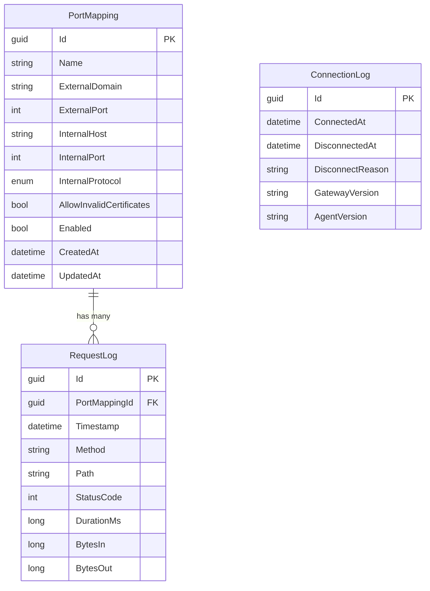

# feat: Octoporty - Reverse Proxy Tunneling Solution

## Overview

Octoporty is a self-hosted reverse proxy tunneling solution similar to ngrok, built in .NET. It enables exposing internal services to the internet through secure tunnels, with a web-based configuration interface.

**Architecture:**
- **Caddy** - Edge proxy for SSL termination on Hetzner cloud
- **Octoporty.Gateway** - Stateless .NET cloud service receiving tunnel connections
- **Octoporty.Agent** - .NET internal service with Web UI, holds master configuration in SQL Server

```
┌─────────────────────────────────────────────────────────────────────────────┐
│                              HETZNER CLOUD                                  │
│  ┌─────────────┐        ┌─────────────────────────────────────────────┐    │
│  │   Caddy     │        │           Octoporty.Gateway                 │    │
│  │   (Edge)    │───────▶│  - Receives tunnel connections              │    │
│  │  SSL Term.  │        │  - Routes requests through tunnels          │    │
│  │  Port 443   │        │  - Configures Caddy via Admin API           │    │
│  └─────────────┘        │  - Stateless (config from Agent)            │    │
│                         └──────────────────┬──────────────────────────┘    │
└─────────────────────────────────────────────┼──────────────────────────────┘
                                              │
                                              │ WebSocket Tunnel
                                              │ (Outbound from Agent)
                                              ▼
┌─────────────────────────────────────────────────────────────────────────────┐
│                           INTERNAL NETWORK                                  │
│  ┌─────────────────────────────────────────────────────────────────────┐   │
│  │                      Octoporty.Agent                                 │   │
│  │  ┌──────────────┐  ┌──────────────┐  ┌──────────────────────────┐  │   │
│  │  │ React Web UI │  │  FastEndpoints │  │  Tunnel Client          │  │   │
│  │  │ (Config)     │  │  (REST API)    │  │  (WebSocket to Gateway) │  │   │
│  │  └──────────────┘  └──────────────┘  └──────────────────────────┘  │   │
│  │                           │                                          │   │
│  │                    ┌──────┴──────┐                                   │   │
│  │                    │  SQL Server │                                   │   │
│  │                    │ (Config DB) │                                   │   │
│  │                    └─────────────┘                                   │   │
│  └─────────────────────────────────────────────────────────────────────┘   │
│                                              │                              │
│                                              ▼                              │
│                              ┌─────────────────────────┐                   │
│                              │   Internal Services     │                   │
│                              │   (HTTP/HTTPS apps)     │                   │
│                              └─────────────────────────┘                   │
└─────────────────────────────────────────────────────────────────────────────┘
```

## Problem Statement / Motivation

**Why build this?**

1. **Self-hosted control** - Unlike ngrok's SaaS model, full control over infrastructure and data
2. **Cost efficiency** - No per-connection or bandwidth fees after initial setup
3. **Privacy** - All traffic routes through your own infrastructure
4. **Customization** - Full control over domains, SSL, and routing rules

**Target Use Cases:**
- Exposing development servers for testing
- Webhook development and debugging
- Accessing internal services remotely
- Demo environments without VPN complexity

## Proposed Solution

Build a three-component system using modern .NET 10 with:

1. **Caddy as edge proxy** - Handles SSL termination, automatic HTTPS certificates
2. **Gateway service** - Stateless tunnel endpoint that receives connections and routes traffic
3. **Agent service** - Master configuration holder with Web UI, establishes outbound tunnel

### Technology Stack

| Component | Technology | Rationale |
|-----------|------------|-----------|
| Runtime | .NET 10 LTS | Latest features, WebSocketStream, long-term support |
| API Framework | FastEndpoints | High performance, vertical slices, FluentValidation |
| Database | SQL Server + EF Core | Enterprise-ready, existing infrastructure |
| Tunnel Protocol | WebSocket over HTTPS | Firewall-friendly, well-supported, bidirectional |
| Real-time UI | SignalR | Status updates, native .NET/browser support |
| Frontend | React + Vite + Tailwind 4 | Modern tooling, fast HMR, CSS-first config |
| Edge Proxy | Caddy | Admin API, automatic HTTPS, simple config |
| Containers | Docker (chiseled images) | 80%+ size reduction, security |

## Technical Approach

### Architecture

#### Component 1: Caddy Configuration

Caddy serves as the SSL-terminating reverse proxy. Configuration via Admin API on port 2019.

**Caddyfile (base configuration):**
```caddyfile
{
    admin 0.0.0.0:2019
    auto_https on
}

# Dynamic routes added via Admin API
```

**Admin API integration from Gateway:**
```csharp
// Gateway adds/removes routes when Agent provides configuration
POST /config/apps/http/servers/srv0/routes
{
  "@id": "tunnel-myapp",
  "match": [{ "host": ["myapp.yourdomain.com"] }],
  "handle": [{
    "handler": "reverse_proxy",
    "upstreams": [{ "dial": "localhost:5000" }]
  }]
}
```

#### Component 2: Octoporty.Gateway

**Responsibilities:**
- Listen for WebSocket connections from Agent
- Authenticate Agent using JWT/shared secret
- Receive configuration from Agent on connect
- Configure Caddy routes via Admin API
- Route incoming HTTP requests through tunnel to Agent
- Detect Caddy restarts and reconfigure

**Key Endpoints:**
```
WebSocket /tunnel          - Bidirectional tunnel connection
GET       /health          - Health check endpoint
GET       /api/v1/status   - Gateway status (for monitoring)
```

**Environment Variables:**
```bash
OCTOPORTY_AUTH_SECRET=<shared-secret-for-jwt-signing>
OCTOPORTY_CADDY_ADMIN_URL=http://localhost:2019
OCTOPORTY_LISTEN_PORT=5000
```

#### Component 3: Octoporty.Agent

**Responsibilities:**
- Store master configuration in SQL Server
- Provide Web UI for configuration management
- Establish outbound WebSocket to Gateway
- Push configuration to Gateway on connect/change
- Forward requests from Gateway to internal services
- Handle reconnection with exponential backoff

**Key Endpoints:**
```
GET/POST  /api/v1/mappings     - CRUD for port mappings
GET       /api/v1/status       - Connection status
POST      /api/v1/reconnect    - Force reconnection
GET       /health              - Health check
SignalR   /hub/status          - Real-time status updates
Static    /*                   - React SPA
```

**Environment Variables:**
```bash
OCTOPORTY_CONNECTION_STRING=<sql-server-connection-string>
OCTOPORTY_GATEWAY_URL=wss://gateway.yourdomain.com/tunnel
OCTOPORTY_AUTH_SECRET=<shared-secret-for-jwt>
OCTOPORTY_UI_USERNAME=admin
OCTOPORTY_UI_PASSWORD=<secure-password>
```

### Data Model

#### Entity: PortMapping

```csharp
// src/Octoporty.Agent/Data/Entities/PortMapping.cs
public class PortMapping
{
    public Guid Id { get; set; }
    public string Name { get; set; } = string.Empty;
    public string ExternalDomain { get; set; } = string.Empty;
    public int ExternalPort { get; set; } = 443;
    public string InternalHost { get; set; } = string.Empty;
    public int InternalPort { get; set; }
    public Protocol InternalProtocol { get; set; } = Protocol.Http;
    public bool AllowInvalidCertificates { get; set; }
    public bool Enabled { get; set; } = true;
    public DateTime CreatedAt { get; set; }
    public DateTime? UpdatedAt { get; set; }
}

public enum Protocol
{
    Http,
    Https
}
```

#### ERD Diagram



### Implementation Phases

#### Phase 1: Foundation & Core Infrastructure

**Tasks:**
- [ ] Create solution structure with projects:
  - `src/Octoporty.Gateway/Octoporty.Gateway.csproj`
  - `src/Octoporty.Agent/Octoporty.Agent.csproj`
  - `src/Octoporty.Shared/Octoporty.Shared.csproj`
  - `src/Octoporty.Agent.Web/` (React app)
- [ ] Set up Entity Framework with SQL Server
- [ ] Create `PortMapping` entity and migrations
- [ ] Implement basic FastEndpoints API for CRUD
- [ ] Set up Docker configurations for both services

**Files to create:**
```
octoporty.sln
src/
├── Octoporty.Gateway/
│   ├── Octoporty.Gateway.csproj
│   ├── Program.cs
│   ├── Dockerfile
│   └── appsettings.json
├── Octoporty.Agent/
│   ├── Octoporty.Agent.csproj
│   ├── Program.cs
│   ├── Dockerfile
│   ├── appsettings.json
│   ├── Data/
│   │   ├── OctoportyDbContext.cs
│   │   └── Entities/
│   │       └── PortMapping.cs
│   └── Endpoints/
│       └── Mappings/
│           ├── ListMappingsEndpoint.cs
│           ├── CreateMappingEndpoint.cs
│           ├── UpdateMappingEndpoint.cs
│           └── DeleteMappingEndpoint.cs
├── Octoporty.Shared/
│   ├── Octoporty.Shared.csproj
│   └── Contracts/
│       ├── TunnelMessage.cs
│       └── ConfigurationSync.cs
└── Octoporty.Agent.Web/
    ├── package.json
    ├── vite.config.ts
    ├── tailwind.config.js
    └── src/
        ├── App.tsx
        └── main.tsx
```

**Success Criteria:**
- Solution builds successfully
- Database migrations run
- CRUD API returns test data
- Docker images build

#### Phase 2: Tunnel Connection & Protocol

**Tasks:**
- [ ] Implement WebSocket server in Gateway (`/tunnel` endpoint)
- [ ] Implement WebSocket client in Agent with reconnection
- [ ] Design tunnel message protocol (JSON over WebSocket)
- [ ] Implement JWT-based authentication on connection
- [ ] Add heartbeat/keepalive mechanism
- [ ] Implement configuration sync on connect

**Tunnel Protocol Design:**
```typescript
// Message types flowing through WebSocket
type TunnelMessage =
  | { type: 'auth', token: string }
  | { type: 'auth_result', success: boolean, error?: string }
  | { type: 'config_sync', mappings: PortMapping[] }
  | { type: 'config_ack', success: boolean, errors?: string[] }
  | { type: 'heartbeat', timestamp: number }
  | { type: 'heartbeat_ack', timestamp: number }
  | { type: 'request', id: string, method: string, path: string, headers: Record<string, string>, body?: string }
  | { type: 'response', id: string, statusCode: number, headers: Record<string, string>, body?: string }
```

**Files to create/modify:**
```
src/Octoporty.Gateway/
├── Services/
│   ├── TunnelConnectionManager.cs
│   ├── TunnelWebSocketHandler.cs
│   └── CaddyConfigurationService.cs
├── Middleware/
│   └── TunnelAuthenticationMiddleware.cs
src/Octoporty.Agent/
├── Services/
│   ├── TunnelClient.cs
│   ├── ReconnectionPolicy.cs
│   └── RequestForwarder.cs
src/Octoporty.Shared/
├── Contracts/
│   ├── TunnelMessages.cs
│   └── AuthenticationContracts.cs
```

**Success Criteria:**
- Agent successfully connects to Gateway
- Configuration syncs on connection
- Heartbeat keeps connection alive
- Automatic reconnection on disconnect

#### Phase 3: Request Routing & Caddy Integration

**Tasks:**
- [ ] Implement Caddy Admin API client
- [ ] Add/remove Caddy routes based on configuration
- [ ] Implement request routing through tunnel
- [ ] Handle request streaming (chunked transfer)
- [ ] Implement error responses (502, 503, 504)
- [ ] Add Caddy health check polling

**Files to create:**
```
src/Octoporty.Gateway/
├── Services/
│   ├── CaddyApiClient.cs
│   ├── CaddyHealthChecker.cs
│   └── RequestRouter.cs
├── Models/
│   └── CaddyConfiguration.cs
```

**Request Flow Implementation:**
```
1. External request hits Caddy
2. Caddy reverse proxies to Gateway
3. Gateway looks up mapping by Host header
4. Gateway serializes request to tunnel message
5. Message sent through WebSocket to Agent
6. Agent deserializes and forwards to internal service
7. Agent receives response, serializes back
8. Gateway receives response, sends to Caddy
9. Caddy returns to client
```

**Success Criteria:**
- External request successfully reaches internal service
- Caddy routes are dynamically created
- Error pages work correctly
- Large requests stream properly

#### Phase 4: Web UI (React + Tailwind 4)

**Tasks:**
- [ ] Set up Vite + React + Tailwind 4
- [ ] Implement authentication (username/password)
- [ ] Create dashboard with connection status
- [ ] Build mappings list with CRUD operations
- [ ] Add real-time status via SignalR
- [ ] Style with Tailwind 4 CSS-first approach

**Files to create:**
```
src/Octoporty.Agent.Web/
├── src/
│   ├── components/
│   │   ├── Layout.tsx
│   │   ├── Sidebar.tsx
│   │   ├── ConnectionStatus.tsx
│   │   ├── MappingCard.tsx
│   │   └── MappingForm.tsx
│   ├── pages/
│   │   ├── Dashboard.tsx
│   │   ├── Mappings.tsx
│   │   ├── MappingDetail.tsx
│   │   └── Login.tsx
│   ├── hooks/
│   │   ├── useMappings.ts
│   │   ├── useStatus.ts
│   │   └── useSignalR.ts
│   ├── api/
│   │   └── client.ts
│   ├── App.tsx
│   ├── main.tsx
│   └── index.css
├── package.json
├── vite.config.ts
└── tailwind.config.js
```

**Success Criteria:**
- User can log in with credentials
- Dashboard shows connection status
- CRUD operations work
- Real-time status updates visible

#### Phase 5: Docker & Deployment

**Tasks:**
- [ ] Create optimized multi-stage Dockerfiles
- [ ] Build and publish images to GitHub Container Registry
- [ ] Create docker-compose for local development
- [ ] Write Hetzner setup script (Ubuntu 24)
- [ ] Add GitHub Actions for CI/CD

**Files to create:**
```
infrastructure/
├── docker-compose.yml
├── docker-compose.dev.yml
├── Caddyfile
└── setup.sh
.github/
└── workflows/
    ├── build.yml
    └── publish.yml
```

**setup.sh script outline:**
```bash
#!/bin/bash
# Octoporty Hetzner Setup Script

# 1. Update system
apt update && apt upgrade -y

# 2. Install Docker
curl -fsSL https://get.docker.com | sh

# 3. Install Caddy
apt install -y debian-keyring debian-archive-keyring apt-transport-https
curl -1sLf 'https://dl.cloudsmith.io/public/caddy/stable/gpg.key' | gpg --dearmor -o /usr/share/keyrings/caddy-stable-archive-keyring.gpg
curl -1sLf 'https://dl.cloudsmith.io/public/caddy/stable/debian.deb.txt' | tee /etc/apt/sources.list.d/caddy-stable.list
apt update && apt install caddy

# 4. Configure Caddy base
cat > /etc/caddy/Caddyfile << 'EOF'
{
    admin 0.0.0.0:2019
}
EOF

# 5. Pull and run Gateway
docker pull ghcr.io/yourorg/octoporty-gateway:latest
docker run -d \
  --name octoporty-gateway \
  --restart unless-stopped \
  -p 5000:5000 \
  -e OCTOPORTY_AUTH_SECRET="${AUTH_SECRET}" \
  -e OCTOPORTY_CADDY_ADMIN_URL=http://host.docker.internal:2019 \
  ghcr.io/yourorg/octoporty-gateway:latest

# 6. Start services
systemctl enable caddy
systemctl start caddy
```

**Success Criteria:**
- Docker images build under 150MB
- Setup script runs on fresh Ubuntu 24
- Services start and connect
- External requests route through

## Alternative Approaches Considered

### Tunnel Protocol Alternatives

| Option | Pros | Cons | Decision |
|--------|------|------|----------|
| **WebSocket** | Firewall-friendly, simple, bidirectional | Single connection bottleneck | **Selected** - Best balance |
| gRPC | Efficient, typed, multiplexed | Complex setup, grpc-web for browser | v2 consideration |
| HTTP/2 | Native multiplexing | Complex stream management | Not needed for 1:1 |
| QUIC | No head-of-line blocking | UDP often blocked, newer | Future consideration |

### Authentication Alternatives

| Option | Pros | Cons | Decision |
|--------|------|------|----------|
| **JWT + Shared Secret** | Simple, stateless verification | Secret management | **Selected** for v1 |
| mTLS | Very secure, no passwords | Complex certificate management | v2 consideration |
| OAuth2/OIDC | Enterprise-friendly | Requires IdP setup | Not needed for single-agent |

### Frontend Alternatives

| Option | Pros | Cons | Decision |
|--------|------|------|----------|
| **React + Vite** | Modern, fast HMR, wide adoption | Need bundling step | **Selected** |
| Blazor WASM | All C#, no JS | Larger bundle, slower startup | Not ideal for simple UI |
| htmx + Razor | No JS build, simple | Less interactive | Too limited for dashboard |

## Acceptance Criteria

### Functional Requirements

- [ ] Agent connects to Gateway via WebSocket over HTTPS
- [ ] Agent authenticates with Gateway using JWT
- [ ] Configuration syncs from Agent to Gateway on connect
- [ ] Gateway configures Caddy routes via Admin API
- [ ] External HTTPS requests route through tunnel to internal services
- [ ] Agent Web UI allows CRUD of port mappings
- [ ] Agent reconnects automatically on disconnect
- [ ] Self-signed internal certificates are optionally accepted

### Non-Functional Requirements

- [ ] Gateway Docker image < 150MB
- [ ] Agent Docker image < 200MB (includes React frontend)
- [ ] Request latency overhead < 50ms (excluding internal service)
- [ ] Support concurrent requests through single tunnel
- [ ] Reconnection within 5 seconds of network recovery

### Quality Gates

- [ ] All endpoints have request validation
- [ ] Error responses use standard HTTP codes with meaningful messages
- [ ] Structured JSON logging in both services
- [ ] Health check endpoints pass before traffic routes
- [ ] Docker images scan clean for critical vulnerabilities

## Dependencies & Prerequisites

### Infrastructure Requirements

- Hetzner Cloud VM (Ubuntu 24)
- Domain with DNS access (for pointing to Hetzner VM)
- SQL Server instance (existing, Agent connects to it)
- GitHub account (for container registry)

### Development Requirements

- .NET 10 SDK
- Node.js 20+
- Docker Desktop
- SQL Server (local or Docker for development)

### External Dependencies

| Package | Purpose | Version |
|---------|---------|---------|
| FastEndpoints | API framework | Latest |
| FluentValidation | Request validation | Latest |
| Microsoft.EntityFrameworkCore.SqlServer | Database | 10.x |
| Microsoft.AspNetCore.SignalR | Real-time UI | Built-in |
| System.Net.WebSockets | Tunnel protocol | Built-in |

## Risk Analysis & Mitigation

| Risk | Probability | Impact | Mitigation |
|------|-------------|--------|------------|
| WebSocket disconnects in unstable networks | Medium | Medium | Exponential backoff reconnection, heartbeat detection |
| Caddy Admin API changes | Low | High | Pin Caddy version, abstract API client |
| SQL Server unavailable | Low | High | Health checks prevent startup, graceful degradation |
| Large request memory pressure | Medium | Medium | Streaming implementation, no buffering |
| Authentication bypass | Low | Critical | JWT validation on every message, short token expiry |

## Success Metrics

| Metric | Target | Measurement |
|--------|--------|-------------|
| Tunnel uptime | 99.9% | Connection log analysis |
| Request success rate | 99.5% | Response status tracking |
| Reconnection time | < 5s | Disconnect-to-connected duration |
| Request latency overhead | < 50ms | End-to-end minus internal service time |
| Docker image size | < 200MB each | CI artifact size |

## Future Considerations

### v2 Features (Not in Scope)

- CLI tool for automation
- Multiple Agent support (1:N Gateway:Agents)
- Path-based routing (multiple backends per domain)
- Request/response logging and replay
- Custom domain per mapping (vs. subdomains)
- Traffic metrics dashboard
- Rate limiting per mapping
- IP allowlisting

### Extensibility Points

- Plugin system for request/response transformation
- Webhook notifications on events
- Integration with external secret managers
- Support for TCP tunnels (non-HTTP)

## References & Research

### Internal References

- Specification: `SPEC.md`

### External References

- [.NET 10 Networking Improvements](https://devblogs.microsoft.com/dotnet/dotnet-10-networking-improvements/)
- [FastEndpoints Documentation](https://fast-endpoints.com/)
- [Caddy Admin API](https://caddyserver.com/docs/api)
- [YARP Reverse Proxy](https://microsoft.github.io/reverse-proxy/)
- [ngrok Architecture](https://ngrok.com/docs/how-ngrok-works)
- [FRP (Fast Reverse Proxy)](https://github.com/fatedier/frp)

### Similar Projects

- [ngrok](https://ngrok.com) - Commercial tunneling solution
- [frp](https://github.com/fatedier/frp) - Open-source Go implementation
- [rathole](https://github.com/rathole-org/rathole) - Lightweight Rust implementation
- [Cloudflare Tunnel](https://developers.cloudflare.com/cloudflare-one/connections/connect-apps) - Cloudflare's solution

---

*Plan created: 2026-01-20*
